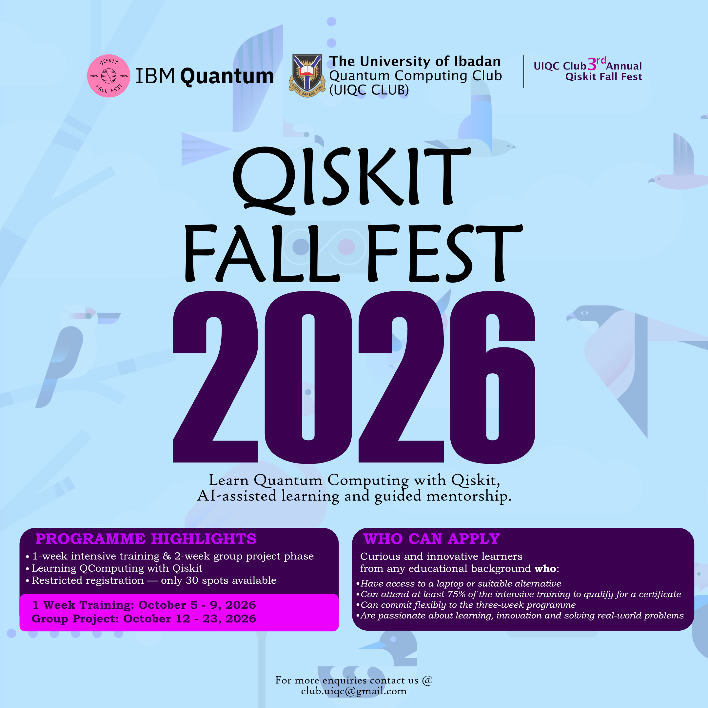

# Qiskit Fall Fest 2026 — UIQC Club

  

  <strong>Learn Quantum Computing with Qiskit, AI-assisted learning, and guided mentorship.</strong>

---

## Welcome

Welcome to the **University of Ibadan Quantum Computing Club (UIQC Club) Qiskit Fall Fest 2026**.

This is the **3rd Annual Qiskit Fall Fest hosted by UIQC Club**, bringing together curious learners interested in exploring quantum computing through hands-on learning, collaborative projects, AI-assisted learning, and guided mentorship.

The programme is designed to make quantum computing accessible to learners from different educational backgrounds while providing opportunities to move from foundational concepts to practical problem-solving with **Qiskit**.

No matter your starting point, the goal is simple:

> **Learn, experiment, collaborate, build, and develop a deeper understanding of quantum computing.**

---

## Programme Overview

The Fall Fest consists of two main phases:

### Phase 1 — Intensive Training

📅 **October 5–9, 2026**

A one-week intensive introduction to quantum computing and Qiskit.

Participants will explore fundamental concepts in quantum computing and learn how to translate these ideas into executable quantum programs using Qiskit.

The training combines:

- Instructor-led sessions
- Hands-on Qiskit exercises
- AI-assisted learning
- Guided mentorship
- Independent exploration
- Collaborative problem-solving

### Phase 2 — Group Project

📅 **October 12–23, 2026**

Participants will work in **teams of two** on a selected quantum computing project or one or more of the provided challenges.

This phase provides an opportunity to apply what was learned during the training, explore problems more independently, and document and communicate results.

---

## What You Will Explore

During the programme, participants will encounter topics and activities involving:

- Foundations of quantum computing
- Qubits, quantum states, and measurement
- Quantum gates and circuits
- Quantum interference and entanglement
- Building quantum circuits with Qiskit
- Running and analysing quantum experiments
- Quantum algorithms and computational ideas
- Quantum computing applications
- Scientific problem-solving with quantum tools
- Responsible AI-assisted technical learning
- Collaborative project development

The emphasis is not simply on writing code that runs.

Participants should aim to understand **what their quantum program is doing, why it works, and how to interpret the results**.

---

## AI-Assisted Learning

AI tools are increasingly useful for learning technical subjects, but they are most effective when used to support rather than replace reasoning.

During the Fall Fest, participants are encouraged to use AI tools to:

- Ask conceptual questions
- Explore unfamiliar mathematical ideas
- Understand Qiskit syntax
- Debug programs
- Compare possible approaches
- Interpret results
- Improve technical explanations
- Identify topics requiring further study

Participants remain responsible for understanding and being able to explain the work they submit.

All significant AI assistance, external references, mentorship, and other resources used during the final project should be appropriately declared.

---

## Guided Mentorship

Participants will not be expected to navigate the programme entirely on their own.

Mentorship is intended to help participants:

- Identify useful learning directions
- Overcome conceptual difficulties
- Debug technical problems
- Develop project ideas
- Evaluate approaches
- Interpret results
- Communicate their work effectively

Mentors are there to **guide the learning process**, not to complete the challenge on behalf of participants.

---

## Challenge Materials

The repository contains challenges at different levels of difficulty.

Current materials include:

| Level / Source | Material |
|---|---|
| Beginner | `01_sample_then_diagonalize.ipynb` |
| Basque Quantum (BasQ) | 3 challenge materials |
| Intermediate | `02_molecules_as_bitstrings.ipynb` |
| quanTA Centre / University of Saskatchewan | 4 prompt materials |
| Qiskit Grader | `in-the-classroom with grader.zip` |
| Advanced | Advanced Notebook |
| Opportunities | QUIP document from Dr. Alexander Geng |

For complete challenge instructions, project requirements, submission rules, and deadlines, see:

➡️ **[Challenge Guide](challenges/challenge.md)**

---

## Important Dates

| Activity | Date |
|---|---|
| Intensive Training | **October 5–9, 2026** |
| Group Project Phase | **October 12–23, 2026** |
| Project Plan Submission | **October 14, 2026** |
| Final Project Submission | **October 21, 2026** |
| Programme Conclusion | **October 23, 2026** |

> Project submission requirements and instructions are provided in [`challenge.md`](challenges/challenge.md).

---

## Who Can Participate?

The programme is intended for curious and innovative learners from **any educational background** who are interested in quantum computing, technology, scientific problem-solving, or emerging computational methods.

Participants should:

- Have access to a laptop or suitable alternative
- Be willing to participate actively in the programme
- Be prepared to learn collaboratively
- Be curious and willing to experiment
- Be able to commit flexibly to the three-week programme

A certificate requires attendance at **at least 75% of the intensive training**.

Registration is restricted to **30 participants**.

---

## Getting Started

If you are participating in the Fall Fest:

1. Clone or fork this repository.
2. Familiarize yourself with the repository structure.
3. Follow the training materials during the intensive training week.
4. Explore the available challenge materials.
5. Form your two-person project team.
6. Select a challenge or propose a suitable project.
7. Submit your project plan by the stated deadline.
8. Develop, document, and test your project in your fork.
9. Submit your final project and assistance declaration.

Detailed project instructions are available in [`challenge.md`](challenges/challenge.md).

---

## Learning Philosophy

This Fall Fest is built around three complementary ideas:

**Learn by understanding.**  
Do not stop at obtaining the correct output. Ask why the result makes sense.

**Learn by doing.**  
Quantum computing becomes clearer when mathematical and physical concepts are translated into circuits, code, experiments, and results.

**Learn with support.**  
Use your teammates, mentors, documentation, references, and AI tools as learning resources while retaining ownership of your reasoning and work.

Mistakes, failed circuits, debugging, unexpected results, and difficult questions are all part of the learning process.

---

## Project Showcase

Participating teams will add their **Team Name** and **Project Title** to [`Project.md`](Project.md) upon completion of their project.

This will serve as a record of the projects developed during the **UIQC Club Qiskit Fall Fest 2026**.

---

## Contact

For enquiries:

📧 `club.uiqc@gmail.com`

**University of Ibadan Quantum Computing Club (UIQC Club)**  
**3rd Annual Qiskit Fall Fest — 2026**

---

### Have fun, experiment boldly, and keep asking questions.

© 2026 University of Ibadan Quantum Computing Club
